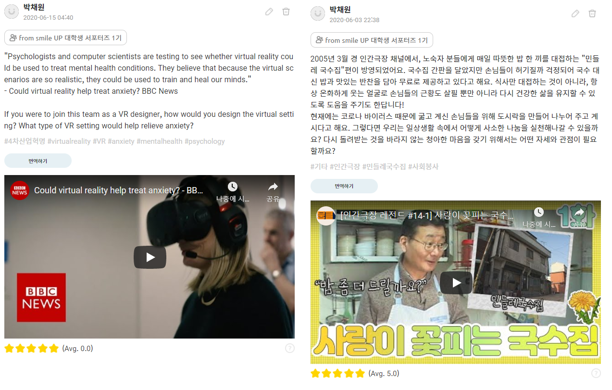

# smile UP activity
Some of my activities were captured upon the approval of app manager.  
"tech for domestic violence prevention" (pdf) is also listed in this folder.
 

   

English translation (top-left): A number of postings on abandoned animal adoption often feature images of incapacitated dogs and cats turning their backs in fear. However, in the high quality images of abandoned animals posted by the Pohang City Animal Protection Center (Korea), animals are smiling brightly. Because the photos can determine whether the abandoned animal gets adopted or being euthanized, the staff members put a lot of efforts to take as best pictures as they can. 
Thanks to the efforts of the staff members, the adoption rate has sparked significantly. However, the adoption dissolution rate has also increased due to people who have made their decisions impulsively based on a single photo of an animal. What efforts does the society as a whole need in order to avoid putting these animals into a even deeper misery due to adoption dissolution?
 
 
English translation (top-right): The following is part of an interview about the songwriting composition of <a href="https://www.youtube.com/watch?v=BzYnNdJhZQw&ab_channel=1theK%28%EC%9B%90%EB%8D%94%EC%BC%80%EC%9D%B4%29">*Through the night*</a>, one of the representative songs of artist IU. "Sleep is so precious to me that it is one of my favorite things. One night, I missed this person so much, but I didn't want to wake this person up because his/her sleep is even more precious than mine. I could have just called this person to say "I miss you" or "I love you", but it was too late at night. Rather than waking this person up to tell him/her "I like you" over the phone, I just confess in my heart: "I will send a firefly by your window to watch out for you, because I want you to have a good night sleep. I think this is what is called love." A tiny yet warm enough to exist - I think this is the definition of firefly, or love.   
 
As indicated in the interview, considerate attitude is one important element for all types of love. Like a firefly in the music video of *Through the night*, what is your own metaphor for love? 
 
 

  

English translation (bottom-right): "Dandelion Noodles House" is a restaurant where homeless people are served a warm daily meal for free. Even though the restaurant seems like a noodle place from its signboard, the owner, who was worried about customers getting hungry quickly from having only noodles, offers rice and sidedishes for free. This restaurant not only serves meals, but also cares for customers to stay healthy and well-functioning. While the owner often faces various challenges such as financial shortage, the mild smile never leave his face. Currently, the restaurant is distributing free lunch boxes for those who are starving due to the coronavirus. Like the restaurant owner at Dandelion Noodles house, how can we be selfless to act with humanitarian intention? What attitude and perspective do we need in order to help others for its own sake (with no expection of getting your kindness returned at some point)? 
