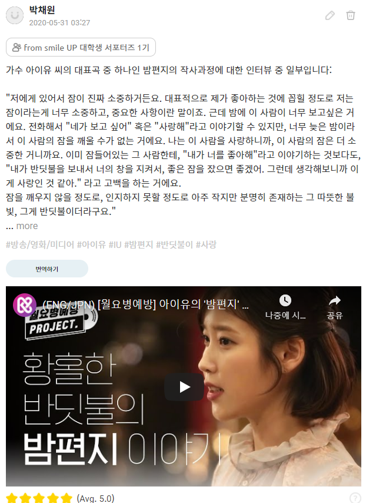

# smile UP activity
Some of my activities were captured upon the approval of app manager.  
### Question 1

   

English translation (top-left): 하루에만 수십 개가 올라오는 유기동물 입양 공고들에서는, 강아지와 고양이가 힘없이 누워있거나 겁에 질려 뒤돌아있는 모습이 많다고 합니다.

하지만 경상북도 포항시 동물보호센터가 올린 유기동물 사진에서는, 동물들이 화질이 선명하고 동물들도 환하게 웃고 있어요. 사진 한 장으로 유기견, 유기묘가 안락사를 당할 수도, 좋은 곳에 입양 갈 수도 있어 정성을 들여 찍을 수밖에 없다고 해요.

포항시 동물보호센터의 노력 덕분에 입양률이 눈에 띄게 올라갔지만, 다른 세부사항을 자세히 읽지 않은 채 사진 한 장만을 보고 충동적으로 입양결정을 내리는 사람들 때문에 파양(입양취소)도 많아졌다고 해요. 동물들에게 파양이라는 2차적인 상처를 주지 않기 위해서는 어떠한 노력과 개선점이 필요할까요?  
English translation (top-right): 가수 아이유 씨의 대표곡 중 하나인 밤편지의 작사과정에 대한 인터뷰 중 일부입니다.

"저에게 있어서 잠이 진짜 소중하거든요. 대표적으로 제가 좋아하는 것에 꼽힐 정도로 저는 잠이라는게 너무 소중하고, 중요한 사항이란 말이죠. 근데 밤에 이 사람이 너무 보고싶은 거에요. 전화해서 "네가 보고 싶어" 혹은 "사랑해"라고 이야기할 수 있지만, 너무 늦은 밤이라서 이 사람의 잠을 깨울 수가 없는 거에요. 나는 이 사람을 사랑하니까, 이 사람의 잠은 더 소중한 거니까요. 이미 잠들어있는 그 사람한테, "내가 너를 좋아해"라고 이야기하는 것보다도, "내가 반딧불을 보내서 너의 창을 지켜서, 좋은 잠을 잤으면 좋겠어. 그런데 생각해보니까 이게 사랑인 것 같아." 라고 고백을 하는 거에요.
잠을 깨우지 않을 정도로, 인지하지 못할 정도로 아주 작지만 분명히 존재하는 그 따뜻한 불빛, 그게 반딧불이더라구요."

서로의 상황을 사려깊게 생각해주는 자세는 남녀 간의 사랑 뿐만 아니라, 우정, 가족애 등과 같은 형태의 사랑에도 적용될 수 있다고 생각해요. 밤편지 속의 '반딧불이'처럼, 여러분이 누군가를 아끼고 사랑하는 마음을 하나의 상징적인 단어로 이야기한다면, 어떻게 표현할 수 있을까요?
 
 

  

English translation (bottom-right): 2005년 3월 경 인간극장 채널에서, 노숙자 분들에게 매일 따뜻한 밥 한 끼를 대접하는 "민들레 국수집"편이 방영되었어요. 국수집 간판을 달았지만 손님들이 허기질까 걱정되어 국수 대신 밥과 맛있는 반찬을 담아 무료로 제공하고 있다고 해요. 식사만 대접하는 것이 아니라, 항상 온화하게 웃는 얼굴로 손님들의 근황도 살필 뿐만 아니라 다시 건강한 삶을 유지할 수 있도록 도움을 주기도 한답니다!
현재에는 코로나 바이러스 때문에 굶고 계신 손님들을 위해 도시락을 만들어 나누어 주고 계시다고 해요. 그렇다면 우리는 일상생활 속에서 어떻게 사소한 나눔을 실천해나갈 수 있을까요? 다시 돌려받는 것을 바라지 않는 청아한 마음을 갖기 위해서는 어떤 자세와 관점이 필요할까요?
